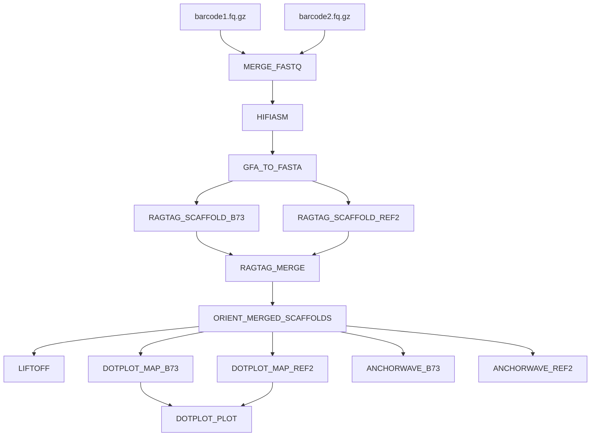

# NIL Assembly Pipeline

Nextflow DSL2 pipeline for maize Near-Isogenic Line (NIL) genome assembly,
scaffolding, annotation, and dotplot visualization on NCSU HPC (LSF).

## Pipeline Overview



## Input

### Sample sheet (`full_run_samplesheet.csv`)

```csv
sample,barcode1,barcode2,ref2
TMEX_NIL,/rsstu/.../bc2049.fastq.gz,/rsstu/.../bc2050.fastq.gz,mexicana
MI21_NIL,/rsstu/.../bc2051.fastq.gz,/rsstu/.../bc2052.fastq.gz,PT
BNI_NIL,/rsstu/.../bc2053.fastq.gz,/rsstu/.../bc2054.fastq.gz,parviglumis
BDI_NIL,/rsstu/.../bc2055.fastq.gz,/rsstu/.../bc2056.fastq.gz,parviglumis
```

Each row is one genotype with two HiFi barcode FASTQs to merge and a per-sample
second reference (`ref2`). B73 is the global first reference for all samples.

### Samples and raw data

All HiFi FASTQs are on RSSTU (read-only):

| Sample | Genotype ID | Barcode 1 | Barcode 2 | Total data | ref2 | Directory |
|--------|-------------|-----------|-----------|------------|------|-----------|
| TMEX\_NIL | TMEX | bc2049 (1.8G) | bc2050 (15G) | 15.8 GB | mexicana | `Inv4mNILS/` |
| MI21\_NIL | Mi21 | bc2051 (4.8G) | bc2052 (7.0G) | 11.8 GB | PT | `BDI_BNI_NILS/` |
| BNI\_NIL | Z031E0047 | bc2053 (4.3G) | bc2054 (9.6G) | 13.9 GB | parviglumis | `BDI_BNI_NILS/` |
| BDI\_NIL | Z031E0050 | bc2055 (7.1G) | bc2056 (12G) | 19.0 GB | parviglumis | `BDI_BNI_NILS/` |

Raw data base path: `/rsstu/users/r/rrellan/sara/DNA_Sequencing_raw/`

The previous bash-based pipeline (Mi21, Z031E0047/bc2051+bc2052, 12 GB total) is at
`/rsstu/users/r/rrellan/DOE_CAREER/inv4m/nilhifimi21/`. Runtime estimates for this
pipeline are based on that run.

All four samples are maize NILs with ~2.3 Gb genomes. BDI\_NIL is the largest input
(19 GB) and produces the most fragmented assembly (2510 contigs), which causes
significantly higher memory usage in RAGTAG (see Resource Utilization).

### Reference genomes

| Reference | FASTA | GFF |
|-----------|-------|-----|
| B73 | `Zm-B73-REFERENCE-NAM-5.0.fa` | `Zm-B73-REFERENCE-NAM-5.0_Zm00001eb.1.gff3` |
| PT | `Zm-PT-REFERENCE-HiLo-1.0.fa` | `Zm-PT-REFERENCE-HiLo-1.0_Zm00109aa.1.gff3` |
| mexicana | `Zx-TIL18-REFERENCE-PanAnd-1.0.fa` | `Zx-TIL18-REFERENCE-PanAnd-1.0_Zx00002ab.1.gff3` |
| parviglumis | `Zv-TIL01-REFERENCE-PanAnd-1.0.fa` | `Zv-TIL01-REFERENCE-PanAnd-1.0_Zv00001aa.1.gff3` |

All under `/rsstu/users/r/rrellan/DOE_CAREER/inv4m/synteny/ref/`. Paths configured
in `nextflow.config` under the `params.refs` block.

**Note:** The PT FASTA uses `PT01`–`PT10` chromosome names while the PT GFF uses
`chr1`–`chr10`. The DOTPLOT\_MAP and ANCHORWAVE modules automatically rename the
FASTA headers (`PT01→chr1`, etc.) to match the GFF before processing.

## Output

Base directory: `params.outdir` (default: `/rsstu/users/r/rrellan/tlaloc/nilhifi/results`)

```
results/
├── {sample}/
│   ├── assembly/
│   │   ├── {sample}_asm.bp.p_ctg.gfa      # primary contig graph
│   │   ├── {sample}_asm.bp.a_ctg.gfa      # alternate contig graph
│   │   └── {sample}.p_ctg.fa              # primary contigs FASTA
│   ├── scaffold/
│   │   ├── B73/
│   │   │   ├── ragtag.scaffold.agp
│   │   │   └── ragtag.scaffold.fasta
│   │   ├── {ref2}/                         # per-sample ref2 (PT, mexicana, parviglumis)
│   │   │   ├── ragtag.scaffold.agp
│   │   │   └── ragtag.scaffold.fasta
│   │   ├── merge/
│   │   │   ├── ragtag.merge.fasta
│   │   │   └── ragtag.merge.agp
│   │   └── oriented/
│   │       ├── {sample}.oriented.fa        # final assembly (chr1–chr10 + unplaced)
│   │       └── scaffold_correspondence.tsv # scaffold-to-chromosome mapping
│   ├── liftoff/
│   │   ├── {sample}_liftoff_B73.gff3       # transferred gene annotations
│   │   └── {sample}_unmapped_B73.txt
│   ├── dotplot/
│   │   ├── dotplot_vs_B73.tab              # CDS anchor coordinates
│   │   ├── dotplot_vs_{ref2}.tab
│   │   ├── {sample}_dotplot_vs_B73.pdf
│   │   ├── {sample}_dotplot_vs_B73.svg
│   │   ├── {sample}_dotplot_vs_{ref2}.pdf
│   │   ├── {sample}_dotplot_vs_{ref2}.svg
│   │   ├── {sample}_chr4_inv4m_dotplot.pdf # Inv4m zoom: B73 vs ref2 side-by-side
│   │   └── {sample}_chr4_inv4m_dotplot.svg
│   └── anchorwave/
│       ├── vs_B73/
│       │   ├── {sample}_vs_B73.maf
│       │   ├── {sample}_vs_B73.f.maf
│       │   └── anchors
│       └── vs_{ref2}/
│           ├── {sample}_vs_{ref2}.maf
│           ├── {sample}_vs_{ref2}.f.maf
│           └── anchors
└── pipeline_info/
    ├── timeline.html
    └── report.html
```

## Running

Submit via the LSF wrapper script — Nextflow runs as a lightweight orchestrator
job (1 CPU, 8 GB) and submits the actual compute jobs to LSF:

```bash
# On HPC
cd /rsstu/users/r/rrellan/tlaloc/nilhifi/nextflow
bsub < q_nil_assembly_pipeline.sh

# Monitor
bjobs -w                    # check orchestrator + child jobs
tail -f results/log/nil_pipeline_<JOBID>.out  # live progress

# Resume after failure or code change
bsub < q_nil_assembly_pipeline.sh   # -resume is built into the script
```

**Do NOT run Nextflow directly on the login node** — use the wrapper script.
Running `nextflow run` interactively on a login node violates HPC AUP and
causes LSF environment issues (missing `bsub`, `lsf.conf`).

## Resource Utilization

Observed from the 4-genome production run (March 17, 2026). All four samples are
maize NILs with ~2.3 Gb genomes. Peak memory from LSF `.command.log` summaries.
ANCHORWAVE data pending (jobs still queued at time of writing).

| Process | CPUs | Mem (alloc) | Mem (peak range) | Wall time (range) | Notes |
|---------|------|-------------|------------------|-------------------|-------|
| MERGE\_FASTQ | 1 | 4 GB | <1 GB | 69–118s | I/O-bound (cat) |
| HIFIASM | 16 | 64 GB | 33–46 GB | 2.7–4.7h | CPU-bound (eff 0.88–0.93) |
| GFA\_TO\_FASTA | 1 | 4 GB | <1 GB | 12–39s | Trivial |
| RAGTAG\_SCAFFOLD | 8 | 128 GB | 66–**144 GB** | 0.9–3.3h | Memory-bound; BDI exceeded 128 GB |
| RAGTAG\_MERGE | 4 | 16 GB | <1 GB | 33–64s | I/O-only |
| ORIENT | 8 | 32 GB | 12–25 GB | ~4m | minimap2 splice + orient |
| LIFTOFF | 8 | 32 GB | 18–20 GB | 25–27m | CPU eff ~0.60 |
| DOTPLOT\_MAP | 8 | 32 GB | 11–13 GB | 4–5m | CPU eff 0.50–0.75 |
| DOTPLOT\_PLOT | 1 | 8 GB | <1 GB | 41–63s | Single-threaded R |
| ANCHORWAVE\_B73 | 8 | 128 GB | 83 GB (TMEX) | ~67m (TMEX) | Pending for other samples |
| ANCHORWAVE\_REF2 | 8 | 128 GB | TBD | ~5h (est.) | Long pole of pipeline |

**Key finding:** BDI\_NIL RAGTAG exceeded 128 GB (136 GB vs B73, 144 GB vs
parviglumis) due to its highly fragmented assembly (2510 contigs). Memory should
be bumped to 192 GB. See `docs/resource_optimization_sop.md` for
detailed per-sample breakdown and optimization recommendations.

### Pipeline reports

Nextflow generates HTML reports each run (overwritten on re-run):

- **Execution report:** [`results/pipeline_info/report.html`](results/pipeline_info/report.html) — per-task resource usage, durations, status
- **Timeline:** [`results/pipeline_info/timeline.html`](results/pipeline_info/timeline.html) — Gantt chart of task execution

## Known Issues and Fixes

### 1. RAGTAG\_MERGE filename collision (fixed)

**Symptom:** `Process RAGTAG_MERGE input file name collision -- There are multiple input files for each of the following file names: ragtag.scaffold.agp`

**Cause:** Both `RAGTAG_SCAFFOLD_B73` and `RAGTAG_SCAFFOLD_PT` emit identically-named
output files (`ragtag.scaffold.agp`, `ragtag.scaffold.fasta`). When Nextflow staged
both sets into the RAGTAG\_MERGE work directory, the names collided.

**Fix:** RAGTAG\_MERGE now uses Nextflow's `path('subdir/filename')` input staging to
place each scaffold's outputs into separate subdirectories (`scaffold_B73/` and
`scaffold_PT/`). The `ragtag.py merge` command receives these directories as arguments,
which is its expected input format. The main workflow was also updated to pass both AGP
and FASTA files (not just AGP) from each scaffold to the merge process.

**Affected files:** `nextflow/modules/ragtag_merge.nf`, `nextflow/main.nf`

### 2. RAGTAG\_SCAFFOLD memory underprovisioned (fixed)

**Symptom:** RAGTAG\_SCAFFOLD was originally allocated 32 GB but minimap2 (asm5 mode on
maize-sized genomes) peaked at 104–114 GB. Tasks happened to succeed because the compute
nodes had sufficient physical memory, but this is not guaranteed.

**Fix:** Memory allocation increased from 32 GB to 128 GB (~12% headroom above the
observed ~114 GB peak).

**Affected file:** `nextflow/modules/ragtag_scaffold.nf`

### 3. Nextflow cache invalidated after pipeline code changes

**Symptom:** After fixing issues #1 and #2, re-running with `-resume` re-submitted
HIFIASM from scratch (~4.3 h) instead of using the cached result from the previous
successful run.

**Cause:** The fixes changed `main.nf` and `ragtag_merge.nf`, producing a new pipeline
revision (`825171e912` vs `75fa3f5b01`). Nextflow computes task cache hashes from the
script content, inputs, and configuration. When `main.nf` changed (workflow wiring),
the cache hashes for all tasks — including upstream tasks like HIFIASM whose process
code did not change — no longer matched, invalidating the entire cache.

**Impact:** The Mar-11 resumed run re-ran MERGE\_FASTQ and HIFIASM despite both having
completed successfully in the Mar-03/04 runs. This added ~4.5 h of redundant compute.

**Lesson:** When fixing downstream processes, be aware that changes to `main.nf` (the
workflow block) can invalidate caches for all processes, not just the ones you modified.
Consider testing workflow-level changes with `-preview` first.

### 4. RAGTAG\_MERGE received directories instead of AGP files (fixed 2026-03-15)

**Symptom:** `ValueError: Input AGPs do not have the same set of components.`

**Cause:** `ragtag.py merge` was called with directory arguments (`scaffold_B73 scaffold_PT`)
instead of explicit AGP file paths. When given a directory, ragtag merge parses files
differently than when given AGP paths directly, leading to a component set mismatch error
even though both AGPs contained identical contig sets.

**Root cause found by:** Comparing with the working bash implementation in
`/rsstu/users/r/rrellan/DOE_CAREER/inv4m/nilhifimi21/scripts/build_scaffold.sh`,
which passes AGP file paths explicitly.

**Fix:** Changed the merge command from:
```
ragtag.py merge -u -o merge_out query.fa scaffold_B73 scaffold_PT
```
to:
```
ragtag.py merge -u -o merge_out query.fa scaffold_B73/ragtag.scaffold.agp scaffold_PT/ragtag.scaffold.agp
```

**Affected file:** `nextflow/modules/ragtag_merge.nf`

### 5. Output directory pointed to old project path (fixed 2026-03-15)

**Symptom:** Pipeline reports (`report.html`, `timeline.html`) written to
`/rsstu/users/r/rrellan/tlaloc/nil_pipeline/results/` instead of the current
project directory.

**Cause:** `params.outdir` in `nextflow.config` still pointed to the old
`nil_pipeline` path from before the project was reorganized into `nilhifi`.

**Fix:** Updated `params.outdir` to `/rsstu/users/r/rrellan/tlaloc/nilhifi/results`.
Copied the Mar-11 report files to the new location.

**Affected file:** `nextflow/nextflow.config`

### 6. Orient scaffold assignment bug — chimeric scaffolds steal chromosomes (fixed 2026-03-17)

**Symptom:** BDI\_NIL chr4 was assigned to `scf00000002_RagTag` (81 MB, only 3 CDS
anchors) while the real chr4 content (`scf00000012_RagTag`, 150 MB, 1327 anchors)
remained unplaced, unoriented, and kept its scaffold name in the output FASTA.

**Cause:** The orient script used a greedy algorithm that sorted scaffolds by total CDS
hit count (across all chromosomes), then assigned each scaffold to its best remaining
chromosome. A chimeric scaffold with high total hits could steal a chromosome assignment
with as few as 1 CDS anchor, blocking the real scaffold from being assigned. The only
threshold was `> 0`.

**Fix:** Replaced with a per-chromosome best-scaffold algorithm. For each B73 chromosome,
find the scaffold with the most CDS anchors (minimum 50). Resolve conflicts by processing
chromosomes in order of their best candidate's strength. Emits a WARNING if no scaffold
meets the threshold.

**Affected file:** `nextflow/bin/orient_scaffolds.py`

### 7. Dotplot labels hardcoded to "PT" for all samples (fixed 2026-03-17)

**Symptom:** All ref2 dotplots labeled "PT" regardless of actual reference (parviglumis,
mexicana). The R script also had a hardcoded scaffold-to-chromosome mapping
(`scaffold_10 → chr4`) from the TMEX test run.

**Fix:** R script accepts `--tab_ref2` and `--ref2_name` arguments. Uses
`find_dominant_scaffold()` to dynamically determine scaffold-chromosome correspondence
from alignment data. Nextflow module extracts ref2 name from the tab filename.

**Affected files:** `nextflow/bin/plot_dotplot.R`, `nextflow/modules/dotplot_plot.nf`

## Claude Code Setup (HPC)

Claude Code requires sandbox configuration to interact with LSF on NCSU HPC.
Run the setup script once (or after any settings reset), then restart Claude Code:

```bash
cd /rsstu/users/r/rrellan/tlaloc/nilhifi
bash docs/claude_code_hpc_setup.sh
```

This configures:
- **`excludedCommands`** — LSF commands (`bsub`, `bjobs`, `bpeek`, `bhist`, `bkill`, `bqueues`) bypass the sandbox so they can write to `/tmp` and reach the LSF master
- **`allowedDomains`** — Network access to `servlsf`, `10.1.16.42` (LSF master), and `github.com`
- **`autoAllowBashIfSandboxed`** — Auto-approve bash commands within sandbox restrictions

See [`docs/claude_code_hpc_setup.md`](docs/claude_code_hpc_setup.md) for full setup details (git identity, push authentication, debugging).

## Key Design Decisions

- **`alignmentToDotplot.pl`** — Perl script from the [AnchorWave protocol](https://github.com/Bio-protocol/anchorwave_protocol)
  (Song et al., 2022). Converts minimap2 SAM + GFF into dotplot tab format
  (refChr, refPos, queryChr, queryPos, strand). Used by ORIENT and DOTPLOT_MAP.
  Not original code — included verbatim from the Bio-protocol repository.
- **No `ragtag correct`** — misinterprets the Inv4m inversion as misassembly
- **hifiasm `-l0`** — disables purge-dups for inbred NILs
- **Per-sample dual-reference scaffolding** — B73 (NIL background) + a per-sample
  ref2 (PT, mexicana, or parviglumis depending on the NIL's wild relative background).
  The ref2 is specified in the samplesheet `ref2` column and resolved at runtime via
  the `params.refs` block in `nextflow.config`.
- **Orient with minimum anchor threshold (50)** — prevents chimeric scaffolds from
  stealing chromosome assignments with trivial CDS hit counts. Uses per-chromosome
  best-scaffold assignment rather than per-scaffold greedy assignment.
- **MAPQ>=60 filtering** on dotplot SAMs to remove multi-mapper noise
- **Liftoff with `-copies`** for CNV detection at JMJ cluster
- **AnchorWave enabled** — whole-genome alignment against B73 and ref2 for synteny analysis
- **`executor.perJobMemLimit = true`** — NCSU HPC sets `LSF_UNIT_FOR_LIMITS=GB`.
  Without this flag, Nextflow's LSF executor divides the requested memory by the
  number of CPUs for the `-M` (hard kill limit) directive, while `rusage[mem=]`
  (reservation) gets the full amount. For example, a process requesting 32 GB
  and 8 CPUs produces `-M 4 -R "rusage[mem=32]"` — LSF reserves 32 GB but kills
  the process at 4 GB. Setting `perJobMemLimit = true` makes `-M` use the total
  requested memory, matching the reservation.
